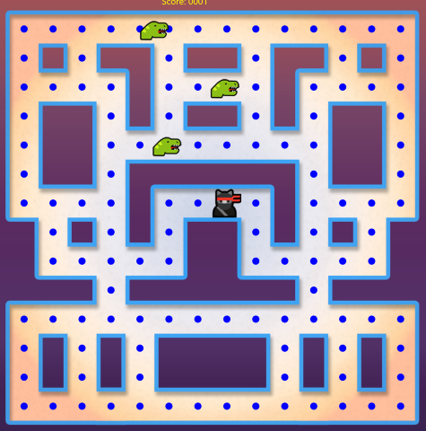

# Win2D-MazeGame

The skeleton of a classic maze chase game for Windows 10, written in C# and using Win2D.

## Introduction

If you’re looking for a project to keep the kids happy, or a way to re-create the 1980’s home computer boom, you might want to try writing your own classic video game. 

A programming library for Windows 10 called [Win2D](https://github.com/Microsoft/Win2D) is perfect for drawing and animating the kind of graphics that defined early video games. 

This project uses Win2D to create the start of a maze chase game – one that you can use as the basis for your own game.  It's written in C#, and comes complete with some basic graphics to start you off.

## Requirements

This game was written on Windows 10 (Build 2004) using Visual Studio 2019.

## Instructions

1. Install the tools - you will need [Visual Studio](https://visualstudio.microsoft.com/). The free Community edition will work perfectly.
2. Download the project from this repo. The simplest way to do this is to select Download ZIP from the green CODE button, and extract all the files.
3. Load it into Visual Studio. You can double-click on game.sln to do this.
4. Build and it and try it out! Make sure the target is set to x86 (in most cases) and press F5. The controls are W, A, S and D.
5. Adapt, improve and learn!

## Details

This is a simple maze chase / eat the dots game that demonstrates using Win2D to display and move images.
The game screen is a 1024 by 1024 canvas object. A single bitmap contains the maze image, but behind the scenes the maze
is a 16 by 16 array of integers with each element defining the possible directions the player or baddie can 
move in. The source code is full of comments to help you.

The images move smoothly until they are centered in a tile, and only then can they change direction.

No "game over" or high scoring events are present. When the player is caught, the game feezes. What happens next is up to you!
